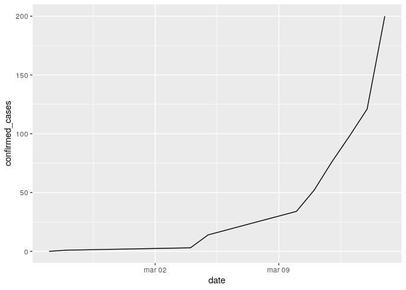

<!-- README.md is generated from README.Rmd. Please edit that file -->

# covid19br

<!-- badges: start -->

[](https://travis-ci.org/paternogbc/covid19br)
<!-- badges: end -->

The goal of covid19br is to provided updated information on the number
of cases of corona virus for Brasil.

## Installation

You can install the released development version of covid19br from
github with:

``` r
devtools::install_github(repo = "paternogbc/covid19br")
```

Check the \[reference page\] for details about the dataset.

## Load the package data

``` r
library(covid19br)
## basic example code

head(covid_br_all)
#>         date  state state_ID suspected_cases confirmed_cases
#> 1 2020-02-25 Brazil       BR               0               0
#> 2 2020-02-26 Brazil       BR               0               1
#> 3 2020-03-04 Brazil       BR               0               3
#> 4 2020-03-05 Brazil       BR               0              14
#> 5 2020-03-10 Brazil       BR             893              34
#> 6 2020-03-11 Brazil       BR             907              52
#>   not_confirmed_cases
#> 1                   0
#> 2                   0
#> 3                   0
#> 4                   0
#> 5                 770
#> 6                 935
```

What is special about using `README.Rmd` instead of just `README.md`?
You can include R chunks like so:

``` r
library(ggplot2)
ggplot(data = covid_br_all, aes(y = confirmed_cases, x = date)) +
  geom_line()
```



Please note that the ‘covid19br’ project is released with a [Contributor
Code of Conduct](CODE_OF_CONDUCT.md). By contributing to this project,
you agree to abide by its terms.
