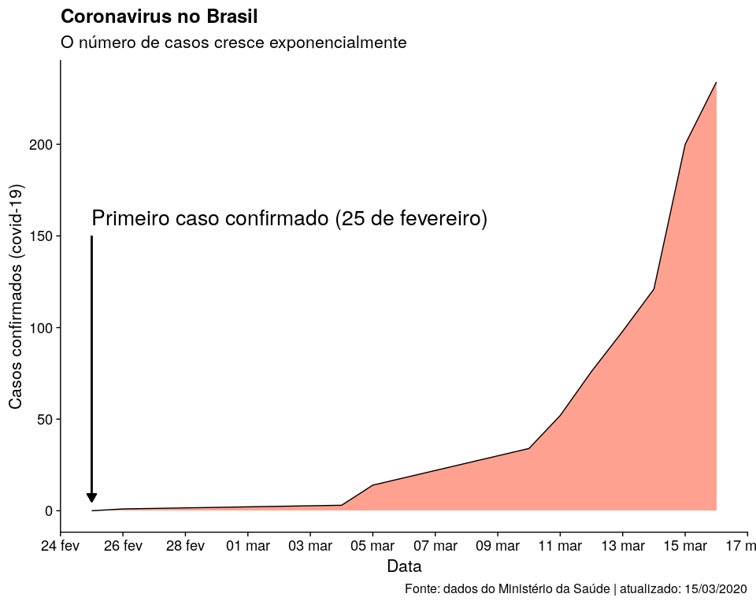
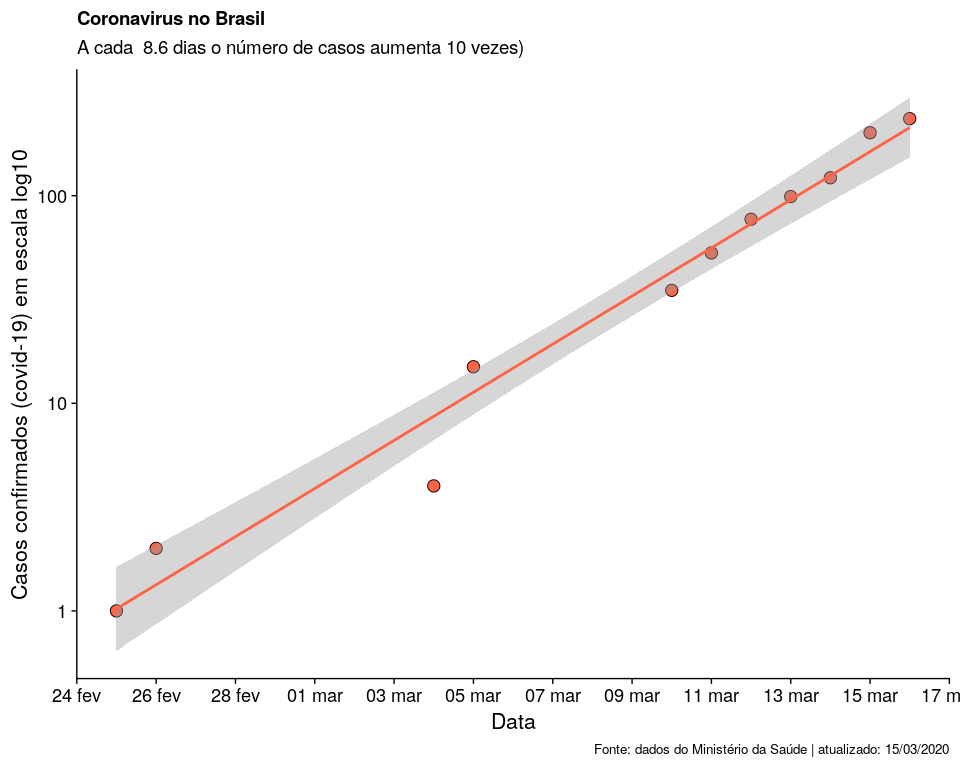
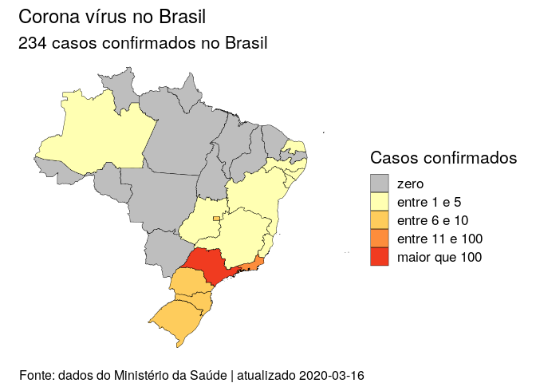

<!-- README.md is generated from README.Rmd. Please edit that file -->

# Dados atualizados: 2020-03-16

# Crescimento do número de casos



# Mapa de distribuição do Corona vírus no Brasil



# Número de casos por estado

| Estado              | Casos suspeitos | Casos confirmados | Casos descartados |
| :------------------ | --------------: | ----------------: | ----------------: |
| Acre                |               3 |                 0 |                 0 |
| Alagoas             |              16 |                 1 |                22 |
| Amapá               |               2 |                 0 |                 0 |
| Amazonas            |               0 |                 1 |                 7 |
| Bahia               |              65 |                 2 |                40 |
| Ceará               |              22 |                 0 |                60 |
| Distrito Federal    |             107 |                13 |                93 |
| Espirito Santo      |              50 |                 1 |                21 |
| Goiás               |               3 |                 3 |                54 |
| Maranhão            |               6 |                 0 |                 2 |
| Mato Grosso         |              14 |                 0 |                 7 |
| Mato Grosso do Sul  |              12 |                 2 |                19 |
| Minas Gerais        |             102 |                 5 |                88 |
| Pará                |               1 |                 0 |                22 |
| Paraíba             |              33 |                 0 |                15 |
| Paraná              |              85 |                 6 |                83 |
| Pernambuco          |              18 |                 2 |                23 |
| Piauí               |               2 |                 0 |                 3 |
| Rio de Janeiro      |              96 |                31 |               153 |
| Rio Grande do Norte |              14 |                 1 |                15 |
| Rio Grande do Sul   |             119 |                 6 |               218 |
| Rondônia            |               2 |                 0 |                 1 |
| Roraima             |               2 |                 0 |                 0 |
| Santa Catarina      |             109 |                 7 |                44 |
| São Paulo           |            1177 |               152 |               623 |
| Sergipe             |               1 |                 1 |                11 |
| Tocantins           |               3 |                 0 |                 0 |

# Acesse os dados com o pacote: `covid19br`

The goal of covid19br is to provided updated information on the number
of cases of corona virus for Brasil.

## Installation

You can install the released development version of covid19br from
github with:

``` r
install.packages("devtools") 
devtools::install_github(repo = "paternogbc/covid19br")
```

## Help

In `R`, documentation for `covid19br` dataset can be accessed with the
standard `help` command (e.g., `?covid_br_all` and `?covid_br_states`).

For a online description of the dataset, see [reference
page](https://paternogbc.github.io/covid19br/reference/index.html)

## Load the package data

``` r
library(covid19br)
## basic example code

head(covid_br_all)
#> # A tibble: 6 x 6
#>   date       state  state_ID suspected_cases confirmed_cases not_confirmed_cases
#>   <date>     <chr>  <chr>              <dbl>           <dbl>               <dbl>
#> 1 2020-02-25 Brazil BR                     0               0                   0
#> 2 2020-02-26 Brazil BR                     0               1                   0
#> 3 2020-03-04 Brazil BR                     0               3                   0
#> 4 2020-03-05 Brazil BR                     0              14                   0
#> 5 2020-03-10 Brazil BR                   893              34                 770
#> 6 2020-03-11 Brazil BR                   907              52                 935
```

Please note that the ‘covid19br’ project is released with a [Contributor
Code of Conduct](CODE_OF_CONDUCT.md). By contributing to this project,
you agree to abide by its terms.
